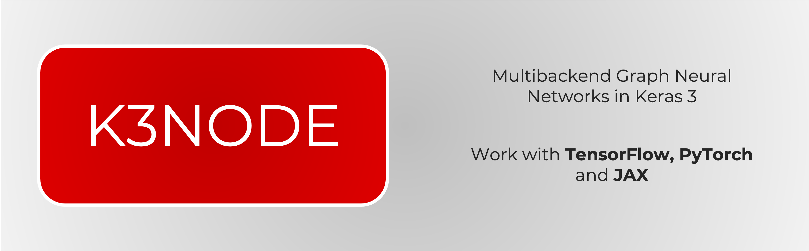

# (WIP) K3 Node: Multi-Backend Graph Neural Networks

Ported from [Spektral](https://github.com/danielegrattarola/spektral/tree/master), [PyTorch Geometric](https://github.com/pyg-team/pytorch_geometric/) and [StellarGraph](https://github.com/stellargraph/stellargraph)

> [!IMPORTANT]
> `K3 Node` only supports operations on sparce adjacency matrix operations with `TensorFlow` backend. Support to sparse adjacency matrix for JAX or PyTorch backends will be added as soon as Keras adds support for sparse operations (Or I may add support for multibackend sparse ops myself using `torch-sparse`, `jax.sparse`) after making the current framework tested and stable.

# What's Included: 

## Convolution Layers
- `AGNNConv`: An Attention-based Graph Neural Network (AGNN)
- `APPNPConv` `PPNPPropagation`: (Approximate) Personalized Propagation of Neural Predictions (PPNP/APPNP)
- `ARMAConv`: An Auto-Regressive Moving Average convolutional layer (ARMA) from the paper
- `CrystalConv`: Crystal Graph Convolutional Neural
- `GatedGraphConv`: Gated Graph Sequence Neural Networks
- `GraphConvolution`: Graph Convolutional Network (GCN)
- `GeneralConv`: A general convolutional layer from the paper: Design Space for Graph Neural Networks
- `GINConv`: A Graph Isomorphism Network (GIN) from the paper: How Powerful are Graph Neural Networks?
- `GraphAttention`: Graph ATtention Network (GAT)
- `SAGEConv`: A GraphSAGE layer from the paper: Inductive Representation Learning on Large Graphs

## Aggregation Layers
- `SumAggregation`
- `MaxAggregation`
- `MeanAggregation`
- `SoftmaxAggregation`
- `PowerMeanAggregation`

## Normalization Layers
- `MeanSubtractionNorm`
- `MessageNorm`

## Attention Layers:
- `Performer`: The linear scaled attention mechanism from the "Rethinking Attention with Performers"

# Contributions
Help us improve K3Node! Report issues, submit patches, or share your suggestions.