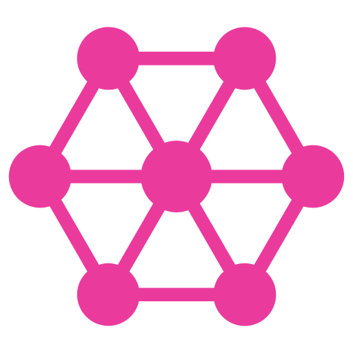

# K3-Node: Multi-Backend Graph Neural Networks

<p align="center">
  
</p>

<p align="center">
  <a href="https://anas-rz.github.io/k3-node/"></a>
  <a href="https://github.com/anas-rz/k3-node/actions"></a>
  <a href="https://github.com/anas-rz/k3-node/blob/main/LICENSE"></a>
  <a href="https://keras.io/keras_3/"></a>
  <a href="https://github.com/psf/black"></a>
</p>

---

**K3-Node** is a next-generation graph neural network (GNN) library built natively on **Keras 3**. Write your GNN models once and execute seamlessly across **TensorFlow**, **PyTorch**, and **JAX** with full hardware acceleration (NVIDIA GPUs, Apple Silicon, Google Cloud TPUs).

K3-Node achieves **100% public API parity** with [PyTorch Geometric (PyG)](https://github.com/pyg-team/pytorch_geometric) and incorporates state-of-the-art foundation models and architectures from [Spektral](https://github.com/danielegrattarola/spektral) and [StellarGraph](https://github.com/stellargraph/stellargraph).

📖 **Documentation**: [https://anas-rz.github.io/k3-node/](https://anas-rz.github.io/k3-node/)  
📋 **Porting Checklist & Parity Status**: [Checklist.md](Checklist.md)

---

## Key Features

- 🔄 **True Multi-Backend Freedom**: Switch between PyTorch, TensorFlow, and JAX with a single environment variable (`KERAS_BACKEND=torch|tensorflow|jax`).
- 🧠 **Pre-trained Foundation Models**: Out-of-the-box architectures and checkpoint loaders for **GraphMAE2**, **Graphormer** (2D & 3D), **GraphGPS**, **GROVER**, and **Mole-BERT**.
- ⚡ **65+ Convolution Layers**: Full PyG parity (`GCNConv`, `GATv2Conv`, `TransformerConv`, `GPSConv`, `PNAConv`, `SchNet`, `DimeNetPlusPlus`, `ViSNet`, etc.).
- 📊 **26 Aggregation Operators**: From elementary aggregations (`sum`, `mean`, `max`, `softmax`, `powermean`) to neural aggregations (`SetTransformer`, `GraphMultisetTransformer`, `Set2Set`, `DeepSets`, `LSTMAggregation`).
- 🌐 **31 Pooling Operators**: Global readouts (`global_add_pool`, `global_mean_pool`), hierarchical coarsening (`TopKPooling`, `SAGPooling`, `ASAPooling`, `EdgePooling`, `ClusterPooling`), and 3D spatial pooling (`voxel_grid`, `fps`, `knn`, `radius`).
- 🧱 **Dense & Scalable GNNs**: Dense matrix convolutions (`DenseGCNConv`, `DenseGATConv`), spectral pooling (`DMoNPooling`, `dense_diff_pool`, `dense_mincut_pool`), and linear-complexity graph transformers (`SGFormer`, `LPFormer`, `Polynormer`).
- 🧭 **Knowledge Graph Embeddings**: Multi-relational link prediction with `TransE`, `RotatE`, `DistMult`, `ComplEx`, and framework-agnostic negative sampling loaders.
- 📦 **Data, Loaders & Transforms**: Full suite of graph data structures (`Data`, `HeteroData`, `Batch`), mini-batch samplers (`NeighborLoader`, `ClusterLoader`, `GraphSAINTSampler`), and 62+ graph and 3D point cloud transforms.
- ✅ **Rigorous Verification**: Over 560 unit tests and cross-framework numerical parity tests verified against PyTorch reference checkpoints.

---

## Installation

```bash
# git should be installed
pip install git+http://github.com/anas-rz/k3-node/
```

### Selecting your Backend
Configure your preferred backend before importing `k3_node`:

```bash
export KERAS_BACKEND="torch"       # or "tensorflow" or "jax"
```

Or programmatically in Python:

```python
import os
os.environ["KERAS_BACKEND"] = "torch"  # Must be set before importing k3_node / keras
import k3_node
```

---

## Quickstart

### Building a Graph Convolutional Network

```python
import keras
from keras import ops
import k3_node.layers as gnn_layers
from k3_node.data import Data

class GCN(keras.Model):
    def __init__(self, in_channels, hidden_channels, out_channels):
        super().__init__()
        self.conv1 = gnn_layers.GCNConv(in_channels, hidden_channels)
        self.conv2 = gnn_layers.GCNConv(hidden_channels, out_channels)

    def call(self, x, edge_index):
        x = self.conv1(x, edge_index)
        x = ops.relu(x)
        x = self.conv2(x, edge_index)
        return x

# Instantiate model
model = GCN(in_channels=16, hidden_channels=32, out_channels=7)

# Forward pass on graph data
x = ops.ones((10, 16))
edge_index = ops.convert_to_tensor([[0, 1, 2, 3], [1, 2, 3, 0]], dtype="int64")

out = model(x, edge_index)
print("Output shape:", out.shape)  # (10, 7)
```

---

## Pre-trained Foundation Models

K3-Node provides ready-to-use architectures and automated checkpoint loading for state-of-the-art graph foundation models:

### 1. GraphMAE2 (Self-Supervised Masked Autoencoder)
```python
from k3_node.models import GraphMAE2
from k3_node.models.graphmae2 import load_graphmae2_weights

model = GraphMAE2(
    in_dim=100,
    num_hidden=512,
    out_dim=100,
    num_layers=4,
    encoder_type="gat",
    decoder_type="gat"
)
# Load reference pre-trained weights
load_graphmae2_weights(model, "checkpoints/graphmae2_ogbn_arxiv.pt")
```

### 2. Graphormer (2D Molecular & 3D Structural Transformer)
```python
from k3_node.models import Graphormer, Graphormer3D
from k3_node.models.graphormer import load_graphormer_weights

# 2D Graphormer (PCQM4Mv2)
model_2d = Graphormer(num_layers=12, num_heads=32, embed_dim=768)
load_graphormer_weights(model_2d, "checkpoints/graphormer_pcqm4mv2.pt")

# 3D Graphormer (OC20 Catalyst Adsorption & Molecular Conformations)
model_3d = Graphormer3D(num_layers=12, num_heads=32, embed_dim=768)
```

### 3. GraphGPS (Hybrid Local MPNN + Global Transformer)
```python
from k3_node.models import GPSModel
from k3_node.models.gps_model import load_gps_model_weights

model = GPSModel(
    channels=64,
    num_layers=5,
    local_gnn_type="GINE",
    global_model_type="Transformer"
)
load_gps_model_weights(model, "checkpoints/graphgps_zinc.pt")
```

### 4. GROVER (Self-Supervised Message Passing Transformer)
```python
from k3_node.models import GROVER, GROVEREmbedding
from k3_node.models.grover import load_grover_weights

model = GROVER(hidden_size=128, num_layers=3, num_heads=4)
load_grover_weights(model, "checkpoints/grover_base.pt")
```

### 5. Mole-BERT (Masked Chemical Graph Representation)
```python
from k3_node.models import MoleBERT
from k3_node.models.mole_bert import load_mole_bert_weights

model = MoleBERT(num_layer=5, emb_dim=300, drop_ratio=0.5)
load_mole_bert_weights(model, "checkpoints/Mole-BERT.pth")
```

---

## What's Included

| Package | Status | Contents |
|---|---|---|
| [`k3_node.layers.conv`](https://anas-rz.github.io/k3-node/api/conv/) | ✅ 65/65 | `GCNConv`, `GATConv`, `GATv2Conv`, `SAGEConv`, `GINConv`, `GPSConv`, `TransformerConv`, `PNAConv`, `SchNet`, `DimeNetPlusPlus`, `ViSNet`, etc. |
| [`k3_node.layers.pool`](https://anas-rz.github.io/k3-node/api/pool/) | ✅ 31/31 | `global_add_pool`, `global_mean_pool`, `TopKPooling`, `SAGPooling`, `ASAPooling`, `EdgePooling`, `ClusterPooling`, `voxel_grid`, `fps`, `graclus`, etc. |
| [`k3_node.layers.aggr`](https://anas-rz.github.io/k3-node/api/aggr/) | ✅ 26/26 | `SumAggregation`, `MeanAggregation`, `SoftmaxAggregation`, `PowerMeanAggregation`, `MultiAggregation`, `SetTransformerAggregation`, `Set2Set`, etc. |
| [`k3_node.layers.norm`](https://anas-rz.github.io/k3-node/api/norm/) | ✅ 11/11 | `GraphNorm`, `PairNorm`, `DiffGroupNorm`, `MessageNorm`, `MeanSubtractionNorm`, `BatchNorm`, `LayerNorm`, `HeteroBatchNorm`, etc. |
| [`k3_node.layers.dense`](https://anas-rz.github.io/k3-node/api/dense/) | ✅ 11/11 | `DenseGCNConv`, `DenseGATConv`, `DenseGINConv`, `DenseSAGEConv`, `DMoNPooling`, `dense_diff_pool`, `dense_mincut_pool`, `Linear`, etc. |
| [`k3_node.layers.kge`](https://anas-rz.github.io/k3-node/api/kge/) | ✅ 5/5 | `KGEModel`, `TransE`, `RotatE`, `DistMult`, `ComplEx`, `KGTripletLoader`. |
| [`k3_node.models`](https://anas-rz.github.io/k3-node/api/models/) | ✅ 46/46 | `MLP`, `GAE`, `VGAE`, `DeepGraphInfomax`, `Node2Vec`, `LabelPropagation`, `LINKX`, `LightGCN`, `SGFormer`, `LPFormer`, `Polynormer`, etc. |
| **Foundation Models** | ✅ 5/5 | `GraphMAE2`, `Graphormer` (2D/3D), `GPSModel`, `GROVER`, `MoleBERT` with pre-trained weight conversion. |
| [`k3_node.data`](https://anas-rz.github.io/k3-node/api/data/) | ✅ 19/19 | `Data`, `HeteroData`, `Batch`, `TemporalData`, `HypergraphData`, `InMemoryDataset`, `FeatureStore`, `GraphStore`, etc. |
| [`k3_node.loader`](https://anas-rz.github.io/k3-node/api/loader/) | ✅ 26/26 | `DataLoader`, `NeighborLoader`, `LinkNeighborLoader`, `ClusterLoader`, `GraphSAINTSampler`, `ShaDowKHopSampler`, etc. |
| [`k3_node.transforms`](https://anas-rz.github.io/k3-node/api/transforms/) | ✅ 62/62 | Topology rewiring, positional encodings (`LapPE`, `RWPE`, `GPSE`), spectral diffusion (`GDC`), and 3D point cloud transforms. |

---

## Interactive Examples

| Backend | Notebook | Description | Link |
|---|---|---|---|
| **TensorFlow** | `ogb_arxiv_spektral_dataset.ipynb` | Node classification on OGB-Arxiv with `ARMAConv` | [](https://colab.research.google.com/github/anas-rz/k3-node/blob/main/examples/tensorflow/ogb_arxiv_spektral_dataset.ipynb) |
| **PyTorch** | `planetoid_PyTorch_Geometric.ipynb` | Node classification on Cora with `GatedGraphConv` | [](https://colab.research.google.com/github/anas-rz/k3-node/blob/main/examples/torch/planetoid_PyTorch_Geometric.ipynb) |

---

## Testing & Verification

Run the comprehensive test suite across backends:

```bash
# Run all unit tests
pytest tests/

# Run reference parity check against PyTorch implementations
pytest tests_reference/
```

---

## License

This project is licensed under the MIT License - see the [LICENSE](LICENSE) file for details.