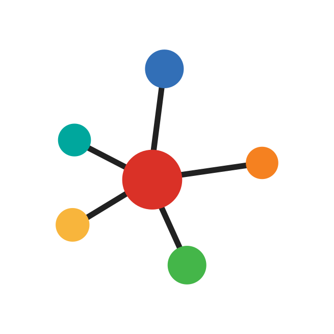

# K3 Node: Multi-Backend Graph Neural Networks

<p align="center">
  
</p>

<p align="center">
  <a href="https://github.com/anas-rz/k3-node"></a>
  <a href="https://anas-rz.github.io/k3-node/"></a>
  <a href="https://github.com/anas-rz/k3-node/blob/main/LICENSE"></a>
  
  
</p>

---

**K3 Node** is a high-performance, multi-backend Graph Neural Network (GNN) library built natively on **Keras 3**. Write GNN models once and execute seamlessly across **TensorFlow**, **PyTorch**, and **JAX** with complete hardware acceleration (NVIDIA GPUs, AMD ROCm, TPUs, Apple Silicon, and CPUs).

K3 Node brings together the comprehensive GNN operator coverage of **PyTorch Geometric (PyG)**, the clean layer abstractions of **Spektral**, and modern state-of-the-art **Graph Foundation Models** with pre-trained weights.

---

## ⚡ Key Highlights

- **Multi-Backend Portability**: Switch between `tensorflow`, `torch`, and `jax` simply by setting `KERAS_BACKEND`.
- **65+ Convolution Layers**: Spatial, spectral, relational, continuous-filter, hypergraph, temporal, and point-cloud graph convolutions.
- **30+ Pooling & Coarsening Layers**: Global pooling, hierarchical Top-K, SAGPooling, EdgePooling, ASAP, MemPooling, and DMoN pooling.
- **25+ Aggregation Operators**: Basic (sum, mean, max, min, mul), scaled (softmax, power-mean, variance, quantiles), and deep neural aggregations (LSTM, GRU, SetTransformer, DeepSets).
- **10+ Normalization Layers**: GraphNorm, PairNorm, DiffGroupNorm, MessageNorm, LayerNorm, InstanceNorm, and BatchNorm.
- **45+ Graph Models**: Standard architectures (GCN, GAT, GIN, SAGE, PNA, EdgeCNN, MLP), link predictors, graph autoencoders (GAE, VGAE, ARGA, ARGVA), and deep scalable transformers (Polynormer, SGFormer, LPFormer, ViSNet).
- **Pre-trained Foundation Models**: Out-of-the-box support for downloading and loading official pre-trained checkpoints:
  - **GraphMAE2**: Masked Autoencoder with multi-task loss and encoder weights.
  - **Graphormer & Graphormer3D**: Graph Transformer for 2D molecular property prediction and 3D quantum chemistry.
  - **GraphGPS**: General Powerful Scalable Graph Transformer with RWSE positional encodings.
  - **GROVER**: Dual-track molecular message-passing transformer for molecular representation learning.
  - **Mole-BERT**: Self-supervised GNN foundation model with categorical bond and atom embeddings.
- **Data & Loader Pipeline**: Flexible graph containers (`Data`, `HeteroData`, `Batch`, `TemporalData`, `HypergraphData`), neighbor loaders, and transform pipelines.

---

## 🚀 Quick Installation

```bash
# Clone the repository
git clone https://github.com/anas-rz/k3-node.git
cd k3-node

# Install in editable mode
pip install -e .
```

Select your backend of choice via an environment variable:

```bash
# PyTorch backend
export KERAS_BACKEND=torch

# TensorFlow backend
export KERAS_BACKEND=tensorflow

# JAX backend
export KERAS_BACKEND=jax
```

---

## 💡 Quick Example

Building and running a 2-layer Graph Convolutional Network in K3 Node:

```python
import os
os.environ["KERAS_BACKEND"] = "torch"  # or "tensorflow" or "jax"

import keras
from keras import layers, ops
import numpy as np
from k3_node.layers.conv import GCNConv
from k3_node.layers.pool import global_mean_pool

class SimpleGNN(keras.Model):
    def __init__(self, hidden_dim=64, num_classes=3):
        super().__init__()
        self.conv1 = GCNConv(hidden_dim)
        self.conv2 = GCNConv(hidden_dim)
        self.classifier = layers.Dense(num_classes)

    def call(self, x, edge_index, batch=None):
        x = ops.relu(self.conv1(x, edge_index))
        x = ops.relu(self.conv2(x, edge_index))
        if batch is not None:
            x = global_mean_pool(x, batch)
        return self.classifier(x)

# Create dummy graph (4 nodes, 4 edges, feature dim 16)
x = ops.convert_to_tensor(np.random.randn(4, 16).astype(np.float32))
edge_index = ops.convert_to_tensor(np.array([[0, 1, 2, 3], [1, 2, 3, 0]]), dtype="int64")

model = SimpleGNN(hidden_dim=32, num_classes=2)
out = model(x, edge_index)
print("Output logits shape:", ops.shape(out))
# Output: (4, 2)
```

---

## 📦 Loading Pre-trained Foundation Models

K3 Node allows you to download and load official pre-trained model weights with a single function call:

```python
from k3_node.models.mole_bert import MoleBERT, load_mole_bert_weights, download_mole_bert_checkpoint

# 1. Download official Mole-BERT checkpoint
ckpt_path = download_mole_bert_checkpoint()

# 2. Instantiate and load weights
model = MoleBERT(num_layer=5, emb_dim=300, num_tasks=1)
load_mole_bert_weights(model, ckpt_path)

print("Mole-BERT loaded successfully!")
```

Explore more pre-trained models in the [Pre-trained Models Guide](api/pretrained.md).

---

## 📚 Documentation Structure

- [Getting Started](quickstart.md): Comprehensive guide to building models, training, and data handling.
- [Multi-Backend Guide](backends.md): Best practices for TensorFlow, PyTorch, and JAX backends.
- [Convolution Layers API](api/conv.md): All 65+ spatial, spectral, and relational convolution layers.
- [Aggregation Layers API](api/aggr.md): Neighborhood aggregation operators.
- [Normalization Layers API](api/norm.md): Graph normalization techniques.
- [Pooling Layers API](api/pool.md): Graph pooling and coarsening.
- [Models API](api/models.md): Complete GNN models and architectures.
- [Pretrained Models API](api/pretrained.md): GraphMAE2, Graphormer, GraphGPS, GROVER, Mole-BERT.
- [Checklist & Parity](checklist.md): Porting checklist and comparison with PyG.
